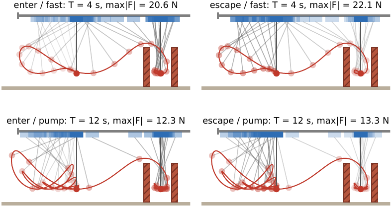
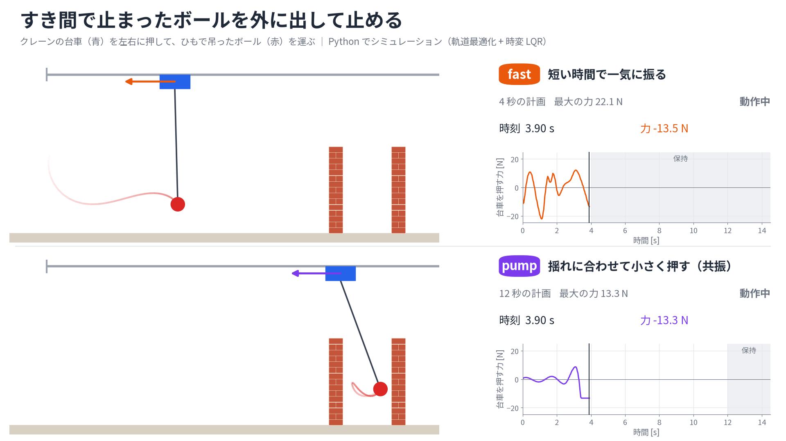

# crane-ball-wall

**吊り下げボールを壁のすき間に出し入れするクレーン** — 軌道最適化 + 時変 LQR による Python での再現と，2 回の独立検証



ガントリークレーン（レール上の台車と、紐で吊ったボール）で、台車を押す力だけを使って次の 2 つの動きをさせるシミュレーション。

- **enter**：静止した状態から、ボールを壁 A の上に振り上げ、2 枚の壁の間の幅 42 cm のすき間に入れて**静止させる**
- **escape**：すき間で静止した状態から、壁 A の上を越えて抜け出し、元の位置（x = 0）で**静止させる**

MathWorks のブログ記事 [Simulate in MATLAB, Animate in Blender](https://blogs.mathworks.com/community/2026/07/31/simulate-in-matlab-animate-in-blender/)
（Ned Gulley）の問題を、MATLAB を使わずに Python（NumPy / SciPy / CasADi / matplotlib）で再現し、紐で吊ったボールをすき間に出し入れする問題に広げたもの。

> *A gantry-crane simulation in Python: swing a ball hanging on a string over a wall into a 42 cm gap between two walls and bring it to rest (enter), or get it back out (escape). Trajectories are optimised with direct multiple shooting (CasADi/IPOPT), tracked with time-varying LQR and verified in continuous time (DOP853). Inspired by MathWorks' "Simulate in MATLAB, Animate in Blender".*

## 動画と論文

| | |
|---|---|
| 動画：enter（上段 fast、下段 pump） | [docs/media/enter.mp4](docs/media/enter.mp4) |
| 動画：escape（上段 fast、下段 pump） | [docs/media/escape.mp4](docs/media/escape.mp4) |
| 論文（12 ページ、過程と検証の詳細） | [docs/paper.pdf](docs/paper.pdf) |
| 解説動画（YouTube、7:48。運動方程式の立式から解き方まで） | [youtu.be/cEGxACeO0iQ](https://youtu.be/cEGxACeO0iQ)（mp4 は [Release explainer-v1](https://github.com/Raptor-zip/crane-ball-wall/releases/tag/explainer-v1)） |
| 要約（2 ページの 2 段組） | [docs/paper_summary.pdf](docs/paper_summary.pdf) |



## 必要なもの

- Python 3.10 以上と [uv](https://docs.astral.sh/uv/)（依存パッケージは `uv sync` で入る）
- 動画の書き出しに ffmpeg（libx264）
- 論文の組版に LuaLaTeX（TeX Live、日本語は LuaTeX-ja）と poppler-utils（`pdftoppm`）
- 動画・図の文字に Noto Sans JP（なければ Noto Sans CJK JP を使う）

## 使い方

```bash
uv sync
uv run python -m ballwall --mission enter  --preset fast    # → out/enter/fast/
uv run python -m ballwall --mission escape --preset fast    # → out/escape/fast/
uv run python -m ballwall --mission enter  --preset pump
uv run python -m ballwall --mission escape --preset pump
uv run pytest                                               # テスト
```

1 回の実行で、軌道の計画（複数の初期値から並列に解く）、閉ループのシミュレーション、検証、図と動画の書き出しまで行う。
fast は 30 秒前後、pump は 2〜3 分かかる。主なオプション：

```bash
uv run python -m ballwall --mismatch 0.1   # 実機のボールがモデルより 10% 重い場合（→ out/enter/fast-mismatch+0.1/）
uv run python -m ballwall --rod            # 紐ではなく剛体の棒（張力の制約なし。→ out/enter/fast-rod/）
uv run python -m ballwall --search         # 時間のかかる本格探索。良い解が見つかれば種を更新する
uv run python -m ballwall --no-seeds       # 保存した種を使わずにゼロから解く
```

出力は `out/<mission>/<preset>/` に書き出す。`--T`・`--rod`・`--mismatch`・`--hold` を既定から変えた実行は、
`fast-rod` のように名前を付けた別のフォルダに書き出し、既定の結果は上書きしない。

| ファイル | 中身 |
|---|---|
| `anim.mp4` | 側面視アニメーション（力のグラフと、壁とのすき間のグラフ付き） |
| `strobe.png` | 軌道のストロボ写真 |
| `summary.png` | 位置・角度・力・壁とのすき間・紐の張力の時系列 |
| `report.json` | 検証結果（最小すき間、最小張力、最大力、レール・速度の範囲、終了時刻 T と保持後の誤差など）と、探索した各初期値の結果 |
| `trajectory.json` | three.js などで再生するためのフレーム列（30 fps の t, x, θ, F とシーン寸法） |
| `plan.npz` | 最適化で求めた名目軌道（ノードの時刻 t、状態 X、区間ごとの力 U） |

### 上下分割の動画（enter と escape の 2 本）

```bash
uv run python -m ballwall.video            # → out/video/enter.mp4, out/video/escape.mp4
uv run python -m ballwall.video --still 3  # 3 秒目の 1 コマだけ PNG で確認する
```

上の 4 つの実行の結果（`trajectory.json`、`report.json`）から作る。1 本の中を上下に分け、上に fast、下に pump を
同じ時計で並べて再生する。1920×1080、30 fps、H.264（yuv420p）で、X（旧 Twitter）にそのまま投稿できる形式。

### 解説動画（YouTube 向け、約 8 分）

公開版：https://youtu.be/cEGxACeO0iQ （書き出した mp4 とサムネイルは GitHub Release `explainer-v1` に置いてある）

運動方程式の立式から、軌道最適化・時変 LQR・検証までを解説する動画を `explainer/` で作る。
数式とアニメーションは Manim、ナレーション（VOICEVOX：ずんだもん）・字幕・チャプターの組み立ては Remotion。

```bash
docker run --rm -d --name voicevox_engine -p 127.0.0.1:50021:50021 voicevox/voicevox_engine:cpu-latest
uv sync --group explainer
./explainer/build.sh        # → explainer/remotion/out/explainer.mp4, thumbnail.png, description.txt
```

| ファイル | 役割 |
|---|---|
| `explainer/script.py` | 台本（字幕と読みの対応）。尺・字幕・チャプターの唯一の出典 |
| `explainer/tts.py` | ナレーションを合成し、実測の長さから `timeline.json` を書く |
| `explainer/prep.py` | 図に使うデータを実際のプランナー・シミュレーターから作る |
| `explainer/manim/scenes.py` | 15 シーン。`timeline.json` の各行の開始時刻にアニメーションを合わせる |
| `explainer/remotion/` | クリップ・音声・字幕・チャプター表示・進捗バーの合成とサムネイル |

### 論文と docs/ の作り直し

```bash
uv run python robustness/exact.py && uv run python robustness/sweep.py
uv run python robustness/thresholds.py && uv run python robustness/mc.py 1000 base
./scripts/build_docs.sh      # 図・論文 2 本・動画を作り直し、docs/ に置く
```

## プリセット：fast と pump

どちらも「決められた時間で、決められた量を最小にする軌道」を最適化で求める。違いは時間と、最小にする量だけ
（どちらにも、力の急な変化を抑える小さな項を足してある）。

| | fast | pump |
|---|---|---|
| 時間 T | 4 秒 | 12 秒 |
| 最小にする量 | 力の2乗の積分 ∫F²dt（力を使う総量） | 主に力の最大値 max\|F\|（モーターの大きさを決める量。重み 20 で ∫F²dt と足す） |
| 動き | 短時間で一気に振って壁を越えさせる | 振り子の揺れに合わせて小さく押し、振り幅を育てる（ブランコをこぐのと同じ） |
| 元記事との対応 | 急加速・急ブレーキの段階 | 共振ポンプ（resonant pump）の段階 |

escape / pump では、隙間の中で左右に3回ずつ揺らして振り幅を育ててから 13 N で引き出し、残りの約 8 秒は揺れに合わせて
逆向きに押して揺れを減らし、x = 0 で止める。enter / pump はその逆の順序になる。

pump の力の最大値は、ポンプ（振り幅を育てる段階）ではなく、隙間への出入りの瞬間（受け止め・引き出し）で決まっている。
T を延ばしてもほとんど下がらない（enter：12 秒 12.34 N → 20 秒 12.29 N → 30 秒 12.26 N、escape：12 秒 13.28 N → 20 秒 13.21 N）。元記事では共振ポンプで最大の力が 1/20 になっているが、
ここでは fast の約 1/1.7 にとどまる（壁の間の狭い隙間に出入りする分だけ、元記事の「壁を1枚越える」問題より難しい）。

## 手法

1. **モデル**（`dynamics.py`）：台車＋質点振り子の非線形運動方程式（台車の粘性摩擦・支点の減衰込み）。入力は台車への水平力 F。
   紐は質量のない伸びない糸として扱い、張力が正（たるまない）であることを制約で保証する。
2. **軌道最適化**（`planner.py`）：多重シューティング法（RK4、力は 50 Hz で区間ごとに一定）で離散化し、CasADi / IPOPT で解く。制約は次のとおり。
   - 開始時と終了時に静止
   - ボール・紐と壁とのすき間 ≥ 2 cm（符号付き距離関数で判定。各ノードと各区間の中点で課す）
   - 紐の張力 ≥ 1.5 N（各区間の始点・中点・終点で課す。力が切り替わる瞬間に張力も跳ぶので、両側の値を見る）
   - レールの端から 3 cm 以上離れる、台車の速度 ≤ 4 m/s、|F| ≤ 40 N

   壁の制約は非凸なので、低い壁から解き始め、前の解を初期値にして少しずつ高くしていく（ホモトピー法）。途中で失敗したら刻み幅を半分にしてやり直す。
3. **多点スタートと種**（`search.py`）：この問題には局所解が多く、初期値によって答えが大きく変わる（escape / fast では力のピーク 38 N の解と 22 N の解がある）。
   22 N の解は「隙間の中でいったん揺らしてから出す」動きで、安い方法ではほとんど見つからない。そこで、
   - 毎回、複数の初期値（ゼロから・もう一方の動きの時間反転・保存した種・種の時間反転・種の時間伸長）から並列に解き、目的関数が最小のものを採用する
   - 見つかった良い解は `ballwall/seeds/*.npz` に種として保存してある（手作業の入力と同じ扱いで、リポジトリに含める）
   - 最後に、勝った解から解き直して目的関数が下がらなくなるまで繰り返す（再実行しても同じ解になるようにするため）
   - `--search` を付けると、細かい分割（N = 600, 800, 1000）で最初から解く時間のかかる候補も試し、より良い解が見つかれば種を更新する。
     この候補は T ≤ 6 秒（fast）だけで使う。fast の種はこの方法で最初から作り直せることを確認済み。
     pump の種は、fast の種を時間方向に引き伸ばしたものから解き直して作った
   - 種には問題設定（物理パラメータ・シーン・制約の設定）の指紋を付け、同じ問題の種とだけ目的関数を比べる
4. **時間反転**：摩擦を除けば運動方程式は時間反転で不変なので、enter の軌道を逆再生すると escape のほぼ実行可能な軌道になる（台車の摩擦は F − 2bv で補正する）。
   これを初期値の1つとして使う。
5. **追従制御**（`control.py`）：最適軌道のまわりで線形化した時変 LQR で軌道を追い、終了後は目標点の LQR で保持する。力は ±40 N で飽和させる。
6. **検証**（`simulate.py`、`__main__.py` の `verify()`）：制御器は 50 Hz のゼロ次ホールド、プラントは DOP853（rtol 1e-10）で連続時間のまま積分する。
   ボール（円）と紐（線分）の壁とのすき間を 1 kHz で厳密に計算し、張力は力が切り替わる直前の値も含めて最小値を取る。
   レールの範囲と速度上限も確かめる。終了時刻 T と保持後の静止誤差は報告するが、合否の判定には使わない。

## 結果（既定の設定、モデル誤差なし）

すべて閉ループ（時変 LQR で追従）のシミュレーション結果。値は `out/<mission>/<preset>/report.json` から生成した。

| | enter / fast | escape / fast | enter / pump | escape / pump |
|---|---|---|---|---|
| 時間 T | 4 s | 4 s | 12 s | 12 s |
| 力の最大値 | 20.6 N | 22.1 N | 12.3 N | 13.3 N |
| ボールと壁の最小すき間 | 1.96 cm | 1.96 cm | 1.96 cm | 1.96 cm |
| 紐と壁の最小すき間 | 6.6 cm | 6.6 cm | 6.5 cm | 6.6 cm |
| 紐の最小張力 | 1.4993 N | 1.4974 N | 1.5000 N | 1.4984 N |
| 台車の最高速度 | 2.99 m/s | 3.01 m/s | 2.81 m/s | 2.79 m/s |
| 台車の位置の範囲 | -0.773〜1.882 m | -0.776〜1.885 m | -0.970〜1.965 m | -0.970〜1.975 m |
| ボールの位置の範囲 | -1.10〜1.76 m | -1.11〜1.76 m | -1.26〜1.76 m | -1.26〜1.76 m |
| 時刻 T での位置誤差 | 1.1e-05 mm | 4.7e-07 mm | 6.9e-07 mm | 1.4e-06 mm |
| 目的関数 | 333.16 | 333.97 | 438.46 | 459.72 |

- 4つとも、壁に当たらず、紐はたるまず、レールと速度の範囲内に収まる（`ok: true`）。
- 時刻 T での目標からの位置誤差は 0.00002 mm 以下、角度誤差は 0.00001° 以下（モデル誤差がない場合。下の「限界と注意」を参照）。
- ボールと壁のすき間は 2 cm、紐の張力は 1.5 N をわずかに下回る（最小 1.96 cm、1.497 N）。どちらの制約も、各区間の
  決まった点（すき間はノードと中点、張力は始点・中点・終点）でしか課していないため、その間で少しだけ下がる。
- enter と escape はほぼ同じ力で済む。運動方程式が時間反転でほぼ不変なので、一方を逆再生するともう一方のほぼ最適な解になる。
- 4つの計画は、どれもボールが 3 か所（壁 A の上面、隙間側の壁 A の右面、壁 B の左面）で 2 cm の余裕ぎりぎりを通る。
  pump の2つは、台車もレール端からの余裕 3 cm ぎりぎり（x = −0.970 m）まで使う。

## 限界と注意

### モデル誤差への頑健性

制御器は名目のモデルで設計し、シミュレーションする実機側の値だけを変えて確かめた（すき間は実機側の紐の長さで計算）。
評価は `robustness/` のスクリプトで行い、結果は `out/robustness/` に書き出す。下の表は、1つずつ変えたときに最初に失敗する大きさ。

```bash
uv run python robustness/exact.py        # out/<mission>/<preset>/plan.npz から評価用の計画を作る
uv run python robustness/sweep.py        # 1つずつ変えた場合の一覧
uv run python robustness/thresholds.py   # 最初に失敗する大きさ（二分法）
uv run python robustness/mc.py 1000 base # 同時に変えた 1000 回のモンテカルロ
```

| 誤差（1つずつ） | enter / fast | escape / fast | enter / pump | escape / pump |
|---|---|---|---|---|
| 紐が長い | +1.8 % | +3.4 % | +1.6 % | +2.9 %（レール端を越える） |
| 紐が短い | −2.1 % | −26 % | −1.6 % | −14 % |
| 台車の質量 | −25 % / +69 % | −36 %（紐がたるむ）/ +38 % | −21 % / +11 % | −44 %（紐がたるむ）/ +20 %（レール端を越える） |
| ボールの質量 | −13 % / +20 % | −70 % まで失敗なし / +29 % | −13 % / +22 % | −70 % まで失敗なし / +46 % |
| 台車の粘性摩擦 | 2.0 倍 | 2.7 倍 | 2.1 倍 | 3.9 倍 |
| 台車のクーロン摩擦 | 0.51 N | 1.1 N | 0.63 N | 2.0 N |
| 力のむだ時間 | 20 ms | 35 ms（紐がたるむ） | 41 ms | 38 ms（紐がたるむ） |
| 力の一次遅れ（時定数） | 20 ms | 50 ms（紐がたるむ） | 40 ms | 54 ms（紐がたるむ） |
| 状態の測定ノイズ（基準の何倍か） | 5.5 倍 | 6.1 倍 | 5.1 倍 | 4.0 倍 |

測定ノイズの基準は 1 mm・0.2°・1 cm/s・1°/s。「失敗」は、壁に当たる、紐がたるむ、レール端を越える、速度上限を超える、のいずれか。

複数の誤差を同時に入れた 1000 回のモンテカルロ（紐の長さ ±1 %、両質量 ±10 %、粘性摩擦 0.5〜1.5 倍、
クーロン摩擦 0〜0.5 N、力の一次遅れ 0〜10 ms、基準の測定ノイズ）での成功率は次のとおり。失敗はすべて壁への接触だった。

| | enter / fast | escape / fast | enter / pump | escape / pump |
|---|---|---|---|---|
| 成功率 | 91.1 % | 99.5 % | 86.1 % | 100 % |

- **enter はモデル誤差に弱い**。計画がボールを隙間の両側の面（壁 A の右面と壁 B の左面）にも 2 cm まで近づけており、
  その接近が追従誤差のたまった後半に来るため、誤差がどちら向きでも壁に当たる。escape は隙間の面への接近が最初の、
  まだ誤差が小さいうちに来るので強い。
- `--mismatch`（ボールの質量だけを変える）で重い側を試すと通るが、軽い側では −15 % で enter が失敗する。
- 制御器は状態に比例するだけで積分動作がない。クーロン摩擦 1 N で、保持 2.5 秒後にも 0.5〜10 mm の位置誤差が残る。
- 対策の候補（未実装）：隙間の面に対するすき間を壁の上面より大きく取る、誤差の範囲を見込んだ計画（ロバスト最適化）、
  LQR の重みの見直し、積分動作や摩擦の補償。

### モデル化していないもの

- 空気抵抗、紐の伸び（張力は最大で約 30 N になる）、ボールの回転の慣性、紐がたるんだ後の運動。
  紐は常に張っている前提で、張力が正であることは確かめているが、たるんだ場合の運動は計算できない。
- 実機のアクチュエータの応答。fast では開始時と終了時に力が約 8 N 階段状に変わる（急な変化は目的関数で抑えているだけ）。
- 壁以外の障害物。pump ではボールがレール端（x = −1.0 m）より 26 cm 外側まで振れる。

### 最適性と再現性

- 求めた解は局所解。2回目の検証で、別の方法（ランダムな摂動、N = 1200 の細かい分割、張力の制約を緩めてから戻す、
  など）で約 40 分探したが、0.5 % 以上良い解は見つからなかった（最大で 0.3 % 良い解）。
- 同じ条件で再実行すると、同じ解（目的関数で相対 1e-9 以内）になることを pump で確認した。


## 幾何の既定値（`params.py`）

振り子の長さ 1.0 m、支点の高さ 1.25 m、ボールの半径 6 cm、壁の高さ 0.75 m・厚さ 12 cm、隙間の幅 42 cm、レールの範囲 −1.0〜3.2 m。
壁が高いほど、ボールが隙間へ出入りする短い間にトロリーが長い距離を移動する必要があり、必要な速度が上がる。
紐ではなく剛体の棒（`--rod`）にすると、張力の条件がなくなる分だけ少し緩む。

## リポジトリの構成

```
ballwall/
  params.py      物理パラメータとシーン（壁・レール）
  dynamics.py    運動方程式、紐の張力、エネルギー（NumPy と CasADi の両方で使う）
  geometry.py    ボール・紐と壁のすき間（最適化用の平滑版と、検証用の厳密版）
  planner.py     直接多重シューティング法による軌道最適化（CasADi / IPOPT）、時間反転
  search.py      多点スタート、種の保存と読み込み
  control.py     時変 LQR と目標点の LQR
  simulate.py    閉ループのシミュレーション（DOP853）
  viz.py         図と 1 本ずつの動画
  video.py       上下分割の動画（enter / escape）
  __main__.py    コマンドライン（計画 → シミュレーション → 検証 → 出力）
  seeds/         見つかった良い解（種）。手作業の入力と同じ扱いで、リポジトリに含める
robustness/      モデル誤差への頑健性の評価（1 つずつ、しきい値、モンテカルロ）
paper/           論文（main.tex）、2 ページの要約（x_summary.tex）、図を作るスクリプト
tests/           物理モデル、幾何判定、時間反転、種、検証のテスト
docs/            README から参照する画像・動画と、組版済みの論文
scripts/         docs/ を作り直すスクリプト
```

## ライセンス

[MIT](LICENSE)。元記事のブログ・動画の画像や映像は含まない（シーンの寸法は動画から比率を読み取って決めた）。

