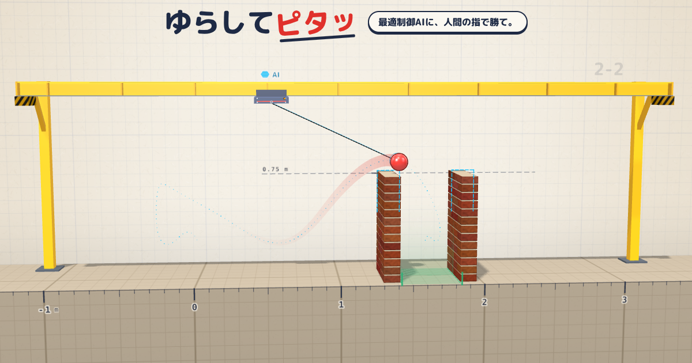

# crane-ball-wall

**クレーンで吊ったボールを振って、壁の向こうでピタッと止める** — その研究コードと、そこから生まれたブラウザゲーム・動画・論文をまとめたリポジトリ。



> *A monorepo around one control problem: a gantry crane swings a ball hanging on a string over a wall and brings it to rest in a 42 cm gap. It holds the research code (trajectory optimisation with CasADi/IPOPT + time-varying LQR, in Python), the browser game "Yurashite Pita / Swing & Stick" built on it (Vite + three.js, Cloudflare Workers + D1), the explainer and promo videos, and two papers.*

## すぐ見る

| | |
|---|---|
| ゲームで遊ぶ（スマホ・PC のブラウザ、無料） | **https://yurapita.raptor-s.workers.dev/** |
| 研究の動画 | [enter](docs/media/enter.mp4)、[escape](docs/media/escape.mp4) |
| 解説動画（YouTube、7:48） | https://youtu.be/cEGxACeO0iQ |
| 研究の論文 | [本文 12 ページ](docs/paper.pdf)、[要約 2 ページ](docs/paper_summary.pdf) |
| ゲームの開発記録（Claude Code に任せて作った過程） | [本文 28 ページ](docs/game_dev_paper.pdf)、[X 用の 2 段組 3 ページ](docs/game_dev_summary.pdf) |
| ゲームの宣伝動画 | GitHub Release [`promo-v1`](https://github.com/Raptor-zip/crane-ball-wall/releases/tag/promo-v1) |

## ここにあるもの

| ディレクトリ | 中身 | 言語・道具 | 説明 |
|---|---|---|---|
| [`ballwall/`](ballwall/) | 研究コード：軌道最適化・時変 LQR・検証・図と動画 | Python（uv、CasADi） | [ballwall/README.md](ballwall/README.md) |
| [`robustness/`](robustness/)、[`tests/`](tests/)、[`scripts/`](scripts/) | 研究の頑健性評価、テスト、`docs/` の作り直し | Python、bash | 同上 |
| [`game/`](game/) | ブラウザゲーム「ゆらしてピタッ」（クライアントと Worker） | TypeScript（Vite、three.js、Cloudflare Workers + D1） | [game/README.md](game/README.md) |
| [`explainer/`](explainer/) | 解説動画 | Manim、Remotion、VOICEVOX | [explainer/README.md](explainer/README.md) |
| [`promo/`](promo/) | ゲームの宣伝動画とありがとうカード | Playwright、Remotion、VOICEVOX | [promo/README.md](promo/README.md) |
| [`paper/`](paper/) | 論文 2 本の LaTeX ソースと図 | LuaLaTeX、matplotlib | [paper/README.md](paper/README.md) |
| [`docs/`](docs/) | README から参照する画像・動画と、組版済みの PDF | — | — |

```
crane-ball-wall/
├── ballwall/        研究コード（Python パッケージ。seeds/ に見つかった良い解）
├── robustness/      モデル誤差への頑健性の評価
├── tests/           研究コードのテスト（uv run pytest）
├── scripts/         docs/ の研究分を作り直す
├── game/            ゲーム（src/ クライアント、worker/ API、tools/ Python のデータ生成、GAME_DESIGN.md 仕様）
├── explainer/       解説動画
├── promo/           宣伝動画（build.sh）とありがとうカード（thanks/）
├── paper/
│   ├── research/    研究の論文
│   └── game_dev/    ゲームの開発記録
├── docs/            組版済みの PDF と、README 用の画像・動画
├── pyproject.toml   Python の依存（研究・ゲームのデータ生成・解説動画で共通）
└── uv.lock
```

`out/`（研究コードの出力）、`node_modules/`、動画の書き出しなど、作り直せるものは `.gitignore` で除いている。

## 部分どうしのつながり

```
ballwall（運動方程式・最適化器）
  ├─→ game/tools/ai_ghosts.py, daily_pool.py … 各面の AI の最短時間解を解いて game/src/data/ に書く
  │     └─→ game（ゲームの物理は同じ運動方程式を TypeScript に移したもの。AI のゴーストとして再生する）
  │           └─→ promo（ゲームを手元で動かして録画する）
  ├─→ explainer（図のデータを実際のプランナーとシミュレーターから作る）
  └─→ paper/research, docs/
```

Python の依存はリポジトリ全体で 1 つ（`pyproject.toml`）。`uv sync` はルートで実行し、`game/` の Python ツールも
ルートの環境で動く（`npm run ghosts` などが中で `uv run` を呼ぶ）。

## 必要なもの

| 使うもの | 研究 | ゲーム | 解説動画 | 宣伝素材 | 論文 |
|---|:-:|:-:|:-:|:-:|:-:|
| Python 3.10+ と [uv](https://docs.astral.sh/uv/) | ○ | データ生成時 | ○ | ○ | ○ |
| Node 24 と npm | | ○ | ○ | ○ | |
| ffmpeg | ○ | | ○ | ○ | |
| VOICEVOX ENGINE（Docker） | | | ○ | ○ | |
| LuaLaTeX（TeX Live、LuaTeX-ja）と poppler-utils | | | | | ○ |
| Noto Sans CJK JP | ○ | | ○ | | ○ |

## ゲームの公開について

`game/` は Cloudflare Workers Builds で GitHub の `main` とつないでいる。**`main` に push すると本番に自動でデプロイされる**
（ルートディレクトリ `game`、ビルド `npm run build`、デプロイ時に D1 のマイグレーションも適用）。
ゲームの現状と引き継ぎ事項は [game/docs/HANDOFF.md](game/docs/HANDOFF.md)、仕様は [game/GAME_DESIGN.md](game/GAME_DESIGN.md) にある。

## ライセンスとクレジット

- コード：[MIT](LICENSE)
- 研究の題材：MathWorks のブログ記事 [Simulate in MATLAB, Animate in Blender](https://blogs.mathworks.com/community/2026/07/31/simulate-in-matlab-animate-in-blender/)（Ned Gulley）。元記事の画像や映像は含まない（シーンの寸法は動画から比率を読み取って決めた）
- 動画のナレーション：VOICEVOX：ずんだもん
- ゲームのフォント：M PLUS Rounded 1c（SIL Open Font License、Google Fonts から読み込む）
- ゲームの 3D 描画：[three.js](https://threejs.org/)（MIT）

作者：貝淵蒼馬
